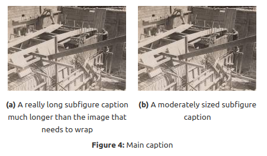

# latexcaption plugin for DokuWiki

Adds syntax for latex-like figure captions and numbering

All documentation for this plugin can be found at
https://github.com/bennvan/dokuwiki-plugin-latexcaption


Originally forked from Till Biskup and mostly re-written. New repo due to change in syntax. 
https://github.com/tillbiskup/dokuwiki-caption


Fixes: 
- No more 'dangerous' string searches to set reference links that appear before a label definition.
- Change syntax to allow multiple classes to be used eg. left, center, right.
- Add ability to have subfigures/tables if your template allows.
- Add option to change caption tag syntax.
- Code easy to expand to caption label more tags if needed.
- Updated some css styles.

The following outputs are using the bootstrap3 template. Please note that the `<caption></caption>` syntax conflicts with bootstraps' caption. I recommend to modify the boostrap3 syntax to use something like `<bscaption></bscaption>`, or alternatively I have provided a setting to change the syntax of this plugin. 

Example output:
-------------


New Syntax/ Example:
-------------


```
<figure opts| fig_label>
 <subfigure opts| subfig_label1>
	{{image1.jpg?direct&200}}
	<caption>Subfig caption1</caption>
 </subfigure>
 <subfigure opts| subfig_label2>
	{{image2.jpg?direct&200}}
	<caption>Subfig caption2</caption>
 </subfigure>
 <caption>Main caption</caption>
</figure>
```

Options:
------------

 - Alignment classes: 'left', 'center', 'right', 'flex-left', 'flex-center', 'flex-even', 'flex-right'
 - Caption behaviour: 'cell-bottom', 'cell-top'. This enforces long captions to be no wider than the image/table. Top and bottom refers to position of caption in relation to figure. Most useful to use this with subfigure captions but also works with main captions. Keep in mind this adds the css style 'display: table' which conflicts with flex or other responsive classes.  
 - No colon: 'blank'. Use this if you dont want to print a ':' after the figure number.

If you want to apply your own css stying to the figures. Any option input are added as a class in the form 'plugin_latexcaption_{option}'.


Example with centering and caption but no label:

```
<figure flex-center blank>
 {{image1.jpg?direct&200}}
 <caption></caption>
</figure>
```

Example subfigure with a long caption:
```
<figure flex-center>
 <subfigure cell-bottom>
 	{{image1.jpg?direct&200}}
 <caption>A really long subfigure caption much longer than the image that needs to wrap</caption>
 </subfigure>
 <subfigure cell-bottom>
	{{image2.jpg?direct&200}}
 <caption>A moderately sized subfigure caption</caption>
 </subfigure>
 <caption>Main caption</caption>
</figure>
```

This gives the output:



In text referencing:
-------------
```
{{ref>label}}
```
Warning: References may render unexpected results if your labels are not unique across all figures, subfigures, tables etc.!

Set counter:
-------------

```
{{setcounter figure=5}}
```

-----

If you install this plugin manually, make sure it is installed in
lib/plugins/latexcaption/ - if the folder is called different it
will not work!

Please refer to http://www.dokuwiki.org/extensions for additional info
on how to install extensions in DokuWiki.

----
Copyright (C) Ben van Magill <ben.vanmagill16@gmail.com>

This program is free software; you can redistribute it and/or modify
it under the terms of the GNU General Public License as published by
the Free Software Foundation; version 2 of the License

This program is distributed in the hope that it will be useful,
but WITHOUT ANY WARRANTY; without even the implied warranty of
MERCHANTABILITY or FITNESS FOR A PARTICULAR PURPOSE.  See the
GNU General Public License for more details.

See the LICENSING file for details
